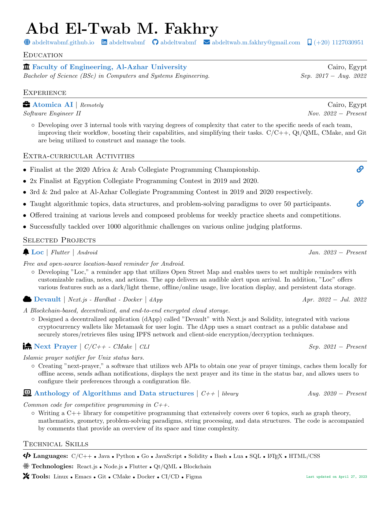

# Resume for Software Engineers

A single-page, one-column resume for Software Engineers. It uses the base latex templates and fonts to provide ease of use and installation when trying to update the resume. The different sections are clearly documented and custom commands are used to provide consistent formatting. The three main sections in the resume are education, experience, and projects.

## Preview



## Build

This resume is compiled using the pdflatex engine, so make sure it is present.

```bash
git clone https://github.com/AbdeltwabMF/resume.git
cd resume
make all clean
```

## Licensed under the [MIT License](LICENSE)
